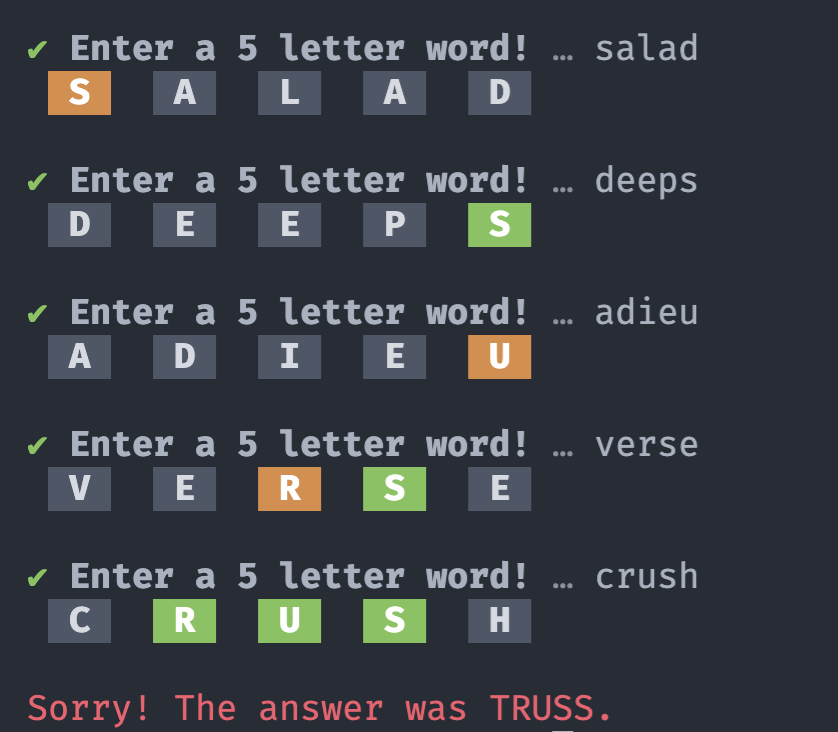
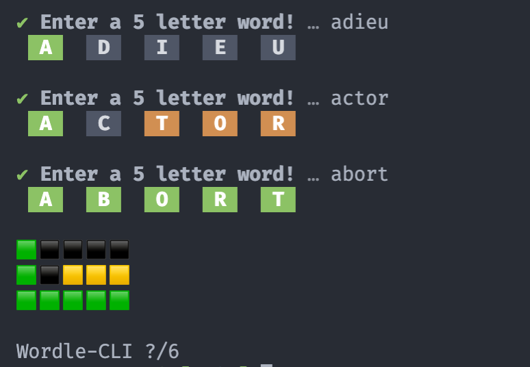

# Wordle-CLI

I got the inspiration to make this from one of VS Code's social media accounts, I don't remember which.
They showed off the prompts library and I decided that I would try something easier but fun.

## How to Use:

Open your terminal and go to whichever directory you would like to download the game in. Then, run the following command.

```bash
git clone https://github.com/Ohmrrr/wordle-cli
```

You will also need to have Node.js installed. I have tested Node.js v12.22.10, but I am not sure if other versions would work with the dependencies. Then, run one of the following (based off of your preferred package manager):

```bash
npm install
yarn install
pnpm install
```

This will install all the dependencies needed. Finally, you can use the start script:

```bash
npm start
yarn start
pnpm start
```

## Examples



<br />

